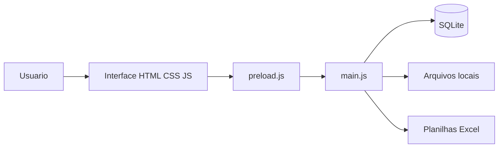
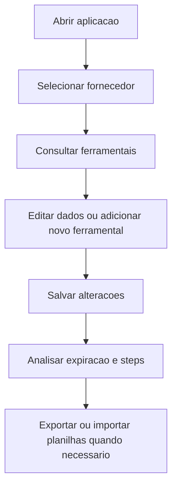
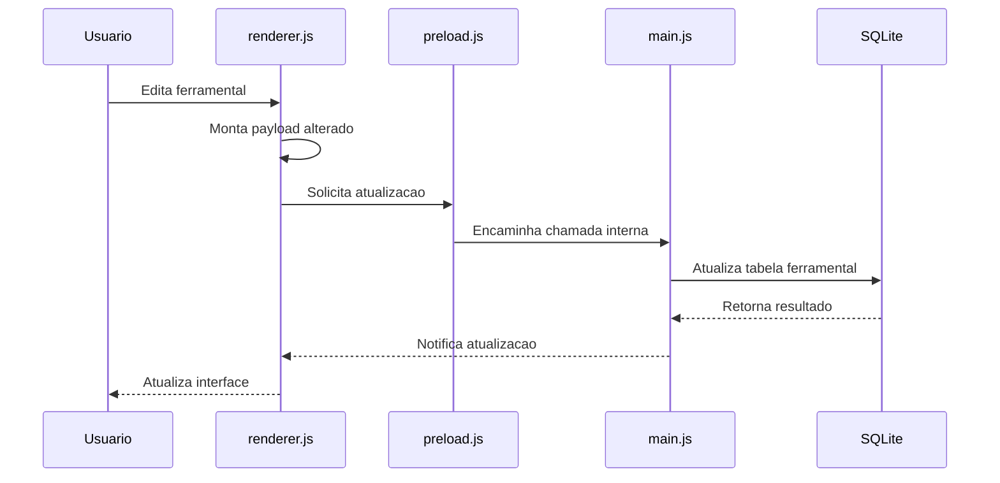
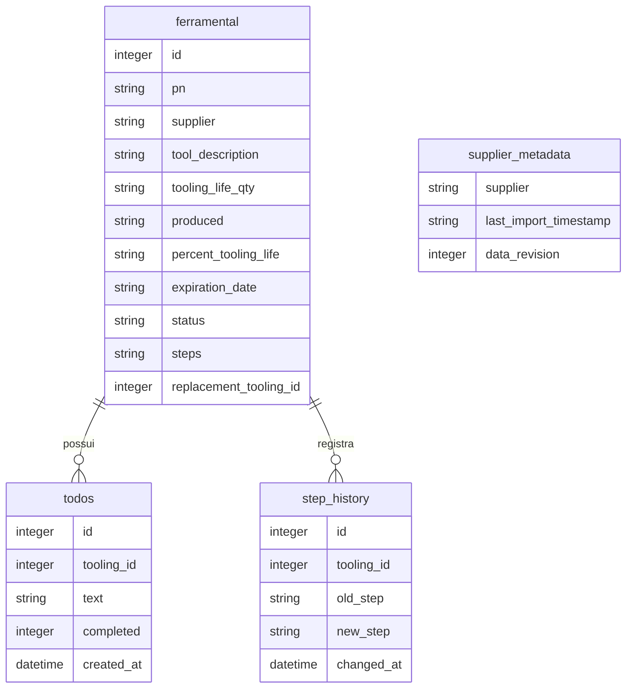

# Documentacao do Tooling Control App

Versao documentada: **0.2.4**  
Última atualização: 23 de Outubro de 2024

---

## 1. Visão Geral

O Tooling Control App é uma aplicação desktop desenvolvida com Electron e SQLite, criada para gerenciar os ferramentais de fornecedores da Cummins. Ele permite o cadastro, acompanhamento, filtragem e atualização do ciclo de vida dos ferramentais, além de gerar exportações/importações padronizadas para os fornecedores.

* Observação: O `package.json` está com versão oficial informada: `0.2.4`.
* A aplicacao e descrita como local e offline, mas os icones Phosphor sao carregados por CDN no `index.html`. Em ambientes sem internet, os icones podem nao aparecer.
* As tabelas `todos` e `step_history` possuem chaves estrangeiras com `ON DELETE CASCADE`, mas o codigo nao ativa explicitamente `PRAGMA foreign_keys = ON`. Isso pode deixar registros orfaos em alguns cenarios.
* Comentarios, contatos e acoes do fornecedor sao salvos no `localStorage` do Electron, nao no banco SQLite. Isso precisa ser considerado em backup e migracoes.
* A importacao por planilha para novo fornecedor exige PN para criar registros, mas alguns campos marcados com `*` no template podem passar vazios. Recomenda-se alinhar validacao e template.

# 1. Visao Geral do Projeto

O **Tooling Control App** e uma aplicacao desktop interna para controle de ferramentais de fornecedores. O objetivo e centralizar informacoes de vida util, producao, previsao anual, status, anexos, comentarios, responsaveis e etapas de acompanhamento.

## Objetivo

Oferecer uma base local e organizada para acompanhar o ciclo de vida dos ferramentais e antecipar riscos de expiracao que possam impactar continuidade de fornecimento.

## Problema Resolvido

O sistema reduz dependencia de planilhas soltas, controles manuais e trocas de arquivos sem padrao. Ele consolida os dados em uma aplicacao unica e permite:

* visualizar fornecedores e seus ferramentais;
* identificar ferramentais expirados ou proximos da expiracao;
* registrar etapas de acompanhamento;
* anexar documentos e imagens;
* importar e exportar dados por planilhas padronizadas.

## Publico-Alvo

* Time interno de Supply Continuity.
* SQE.
* Planejamento, Sourcing e gestores envolvidos no controle de ferramentais.
* Desenvolvedores responsaveis por manutencao da aplicacao.

## Principais Funcionalidades

| Funcionalidade | Descricao resumida |
|---|---|
| Gestao de fornecedores | Lista fornecedores e agrupa seus ferramentais. |
| Controle de ferramentais | Cadastra, edita, salva e exclui registros. |
| Vida util e expiracao | Calcula vida restante, percentual consumido e data estimada de expiracao. |
| Filtros e busca | Filtra por fornecedor, colunas, status, steps, expiracao e alteracao de vida util. |
| Importacao e exportacao | Usa arquivos Excel padronizados para fornecedor e gestor. |
| Anexos | Guarda arquivos e imagens por fornecedor e por ferramental. |
| Comentarios | Mantem historico de comentarios do ferramental e acoes do fornecedor. |
| Analytics | Mostra indicadores gerais, steps e linha temporal de acompanhamento. |
| Configuracoes | Permite ajustar status e abrir DevTools. |

# 2. Arquitetura do Sistema

A aplicacao segue uma arquitetura desktop local baseada em Electron.



## Visao Geral

* **Frontend:** `index.html`, `style.css` e `renderer.js`.
* **Ponte segura:** `preload.js`, expondo funcoes controladas para a interface.
* **Processo principal:** `main.js`, responsavel por janela, arquivos, Excel, dialogs e comunicacao com banco.
* **Banco de dados:** `tooling-database.js`, com acesso SQLite e regras principais de persistencia.
* **Armazenamento local de arquivos:** pasta `attachments/`.

## Tecnologias Utilizadas

| Tecnologia | Uso |
|---|---|
| Electron 28 | Aplicacao desktop Windows. |
| Node.js | Runtime do processo principal. |
| SQLite3 | Banco local da aplicacao. |
| ExcelJS | Geracao e leitura de planilhas Excel. |
| HTML, CSS e JavaScript | Interface sem framework frontend. |
| Phosphor Icons | Icones da interface. |
| electron-builder | Geracao do executavel portatil. |

## Estrutura de Pastas e Arquivos

| Caminho | Finalidade |
|---|---|
| `src/main/main.js` | Processo principal, IPC interno, Excel, anexos e janela Electron. |
| `src/main/tooling-database.js` | Classe de acesso ao SQLite e regras de banco. |
| `src/main/preload.js` | Ponte segura entre renderer e main. |
| `src/renderer/renderer.js` | Logica da interface, filtros, cards, planilha, modais e analytics. |
| `src/renderer/index.html` | Estrutura visual e modais. |
| `src/renderer/style.css` | Estilos da aplicacao. |
| `assets/ferramentas.ico` | Icone da aplicacao, usado na janela e no build. |
| `docs/DOCUMENTACAO.md` | Esta documentacao. |
| `ferramental_database.db` | Banco SQLite local, na raiz do projeto. |
| `attachments/` | Anexos e imagens dos fornecedores e ferramentais, na raiz. |
| `dist/` | Saida do build gerado pelo electron-builder. |
| `package.json` | Scripts, dependencias e configuracao de build. |

O banco e a pasta `attachments/` ficam na **raiz do projeto**, nao dentro de
`src/`. Em desenvolvimento, `getAppBaseDir()` resolve essa raiz subindo dois
niveis a partir de `src/main/`; no modo portatil, `PORTABLE_EXECUTABLE_DIR`
tem precedencia.

## Dependencias Principais

* `electron`
* `electron-builder`
* `electron-rebuild`
* `sqlite3`
* `exceljs`

# 3. Guia de Instalacao

## Pre-Requisitos

* Windows 10 ou Windows 11.
* Node.js 16 ou superior para desenvolvimento.
* npm 8 ou superior.

## Instalar Dependencias

```bash
npm install
```

## Executar Localmente

```bash
npm start
```

ou:

```bash
npm run dev
```

## Gerar Executavel

```bash
npm run dist
```

O build atual gera um executavel portatil em `dist/`, conforme configuracao do `package.json`.

## Variaveis de Ambiente

| Variavel | Uso |
|---|---|
| `PORTABLE_EXECUTABLE_DIR` | Quando disponivel, define o diretorio base usado para localizar banco e anexos no modo portatil. |

## Deploy Interno

Para distribuicao interna, usar o executavel gerado em `dist/`. O banco `ferramental_database.db` e criado ou copiado para o diretorio base da aplicacao. A pasta `attachments/` e criada automaticamente quando houver anexos.

# 4. Manual do Usuario

## Como Acessar

Abra o executavel **Tooling Control App.exe** ou execute pelo ambiente de desenvolvimento com `npm start`.

## Navegacao Principal

A aplicacao possui tres abas principais:

| Aba | Finalidade |
|---|---|
| Tooling | Consulta e edicao dos ferramentais por fornecedor. |
| Analytics | Indicadores, steps e visao de acompanhamento. |
| Settings | Status personalizados, tecnologias e ferramentas de desenvolvimento. |

## Fluxo Tipico de Uso



## Selecionar Fornecedor

Na lateral esquerda, selecione um fornecedor. A lista de ferramentais sera exibida na area principal em formato de tabela com linhas expansivas.

## Criar Ferramental

Use o botao de adicionar na barra inferior. Campos principais:

* PN.
* Supplier.
* Tooling Life Qty.
* Produced.
* Production Date, quando aplicavel.
* Annual Volume Forecast, quando aplicavel.

Ao criar um ferramental, o sistema registra um comentario inicial informando a vida util cadastrada.

## Editar Ferramental

Abra a linha do ferramental, altere os campos desejados e clique em **Save**. A aplicacao marca visualmente quando existem alteracoes pendentes.

## Excluir Ferramental

A exclusao exige confirmacao por codigo. Ao excluir, os anexos do item tambem sao removidos da pasta de arquivos.

## Anexar Arquivos e Imagens

Os anexos podem ser adicionados por clique ou arrastar e soltar. Existem dois tipos principais:

* **Attachments:** documentos gerais do ferramental.
* **Pictures:** imagens do ferramental.

## Comentarios e Acoes

O ferramental possui comentarios registrados no banco. O fornecedor possui uma tela de acoes e contatos, armazenada localmente no perfil da aplicacao.

## Importar e Exportar Planilhas

O sistema trabalha com planilhas Excel padronizadas:

* exportacao de dados do fornecedor;
* importacao de dados do fornecedor;
* template vazio para novo fornecedor;
* exportacao e importacao de Annual Volume;
* exportacao e importacao da base completa para gestor.

# 5. Documentacao Funcional Resumida

## Gestao de Fornecedores

| Item | Descricao |
|---|---|
| Objetivo | Agrupar ferramentais por fornecedor. |
| Entrada | Nome do fornecedor nos registros. |
| Saida | Lista lateral com fornecedores e metricas. |
| Regras | Fornecedores vazios nao aparecem na lista. Nomes duplicados nao sao permitidos na renomeacao. |
| Erros comuns | Nome vazio, tentativa de renomear para fornecedor existente ou erro ao mover anexos. |

## Cadastro e Edicao de Ferramental

| Item | Descricao |
|---|---|
| Objetivo | Manter os dados principais do ferramental. |
| Entrada | PN, fornecedor, vida util, produzido e campos complementares. |
| Saida | Registro salvo na tabela `ferramental`. |
| Regras | PN e fornecedor sao obrigatorios. Numeros negativos nao devem ser usados. |
| Motivo da regra | Sem PN e fornecedor nao e possivel rastrear o item nem agrupa-lo corretamente. |
| Erros comuns | Campos obrigatorios vazios, numeros invalidos ou alteracoes nao salvas. |

## Calculo de Vida Util

| Item | Descricao |
|---|---|
| Objetivo | Mostrar quanto da vida util ja foi consumido. |
| Entrada | `tooling_life_qty` e `produced`. |
| Saida | `remaining_tooling_life_pcs` e `percent_tooling_life`. |
| Regra | Vida restante = vida util menos produzido. Percentual = produzido dividido pela vida util. |
| Motivo da regra | Permite priorizar ferramentais mais proximos do fim de vida. |

## Calculo de Expiracao

| Item | Descricao |
|---|---|
| Objetivo | Estimar quando o ferramental deve expirar. |
| Entrada | Vida restante, Annual Volume e Production Date. |
| Saida | Data estimada de expiracao. |
| Regra | Quando Annual Volume existe, a estimativa usa vida restante dividida pelo volume anual e multiplica por 365 dias. |
| Motivo da regra | A expiracao precisa considerar ritmo previsto de consumo, nao apenas quantidade restante. |

## Status do Ferramental

| Item | Descricao |
|---|---|
| Objetivo | Classificar a situacao do ferramental. |
| Entrada | Campo `status`. |
| Saida | Status visivel na tabela e nos cards. |
| Regras | Opcoes padrao: ACTIVE, UNDER CONSTRUCTION, OBSOLETE e INACTIVE. |
| Motivo da regra | Padronizar filtros, relatorios e leitura operacional. |

## Steps de Acompanhamento

| Step | Acao | Responsavel |
|---|---|---|
| 1 | Control Data Update | Supply Continuity |
| 2 | Critical Tooling Identification | Supply Continuity |
| 3 | Supplier Validation Request | Supply Continuity |
| 4 | Critical Tooling Reassessment | Supply Continuity |
| 5 | On-Site Technical Analysis | SQE |
| 6 | Technical Confirmation | SQE |
| 7 | Supply Continuity Strategy | Sourcing Manager |

Os steps ajudam a acompanhar o processo de gestao do ferramental desde a atualizacao de dados ate a estrategia de continuidade.

## Importacao e Exportacao

| Item | Descricao |
|---|---|
| Objetivo | Trocar dados com fornecedores e gestores via Excel. |
| Entrada | Arquivos `.xlsx` gerados pelo sistema. |
| Saida | Registros criados ou atualizados no SQLite. |
| Regras | Planilhas oficiais possuem aba oculta de verificacao. Arquivos fora do padrao podem ser recusados. |
| Motivo da regra | Evita importacao acidental de planilhas incorretas. |

## Anexos

| Item | Descricao |
|---|---|
| Objetivo | Guardar documentos e imagens relacionados ao fornecedor ou ferramental. |
| Entrada | Arquivos selecionados, arrastados ou imagens coladas. |
| Saida | Arquivos copiados para `attachments/`. |
| Regras | Pictures aceita apenas imagens. |
| Motivo da regra | Separar evidencias visuais de documentos gerais facilita consulta. |

## Analytics

| Item | Descricao |
|---|---|
| Objetivo | Exibir indicadores de controle. |
| Entrada | Dados da tabela `ferramental` e historico de steps. |
| Saida | Totais, expirados, proximos da expiracao, fornecedores e steps. |
| Regra | Ferramentais obsoletos com substituto vinculado nao entram como expirados criticos. |
| Motivo da regra | Evita priorizar itens que ja possuem cadeia de substituicao definida. |

# 6. Documentacao Tecnica Resumida

## Fluxo Interno



## Backend

O backend fica no processo principal Electron:

* cria a janela;
* abre dialogs de arquivo;
* le e grava Excel;
* manipula anexos no sistema de arquivos;
* chama a camada `ToolingDatabase`;
* envia eventos de atualizacao para a interface.

## Frontend

O frontend e uma interface HTML, CSS e JavaScript puro. O arquivo `renderer.js` concentra:

* carregamento de fornecedores;
* renderizacao da tabela e cards;
* filtros;
* modais;
* comentarios;
* anexos;
* configuracoes;
* analytics.

## Banco de Dados

O banco e local, em SQLite, no arquivo `ferramental_database.db`. O schema e criado ou ajustado na inicializacao da aplicacao.

## Autenticacao

Nao ha autenticacao no codigo atual. O controle de acesso depende do ambiente interno e do acesso ao executavel e aos arquivos locais.

## Armazenamento Fora do Banco

| Tipo de dado | Local |
|---|---|
| Banco principal | `ferramental_database.db` |
| Anexos e imagens | `attachments/` |
| Acoes e contatos do fornecedor | `localStorage` do Electron |
| Preferencias de UI | `localStorage` do Electron |

# 7. Modelo de Dados



## Tabelas

| Tabela | Finalidade |
|---|---|
| `ferramental` | Registro principal dos ferramentais. |
| `supplier_metadata` | Metadados por fornecedor, como revisao e ultima importacao. |
| `todos` | Tarefas vinculadas a um ferramental. |
| `step_history` | Historico de mudancas de step. |

## Campos Importantes da Tabela `ferramental`

| Campo | Descricao |
|---|---|
| `id` | Identificador unico do ferramental. |
| `pn` | Part Number. |
| `supplier` | Fornecedor. |
| `tool_description` | Descricao do ferramental. |
| `tooling_life_qty` | Vida util prevista. |
| `produced` | Quantidade ja produzida. |
| `remaining_tooling_life_pcs` | Vida restante calculada. |
| `percent_tooling_life` | Percentual de vida consumida. |
| `annual_volume_forecast` | Volume anual previsto. |
| `date_remaining_tooling_life` | Data de referencia da producao. |
| `date_annual_volume` | Data de referencia do volume anual. |
| `expiration_date` | Data estimada ou registrada de expiracao. |
| `status` | Status operacional. |
| `steps` | Etapa atual do processo. |
| `cummins_responsible` | Responsavel interno. |
| `comments` | Comentarios do ferramental em JSON. |
| `analysis_notes` | Notas de analise. |
| `replacement_tooling_id` | Ferramental substituto vinculado. |
| `analysis_completed` | Indica se a analise de item expirado foi concluida. |

# 8. Guia de Manutencao

## Adicionar Funcionalidade

Fluxo recomendado:

1. Identificar se a mudanca e de interface, banco, arquivo ou Excel.
2. Alterar `renderer.js` para comportamento visual.
3. Alterar `preload.js` se uma nova chamada interna for necessaria.
4. Alterar `main.js` para operacoes de arquivo, Excel ou integracao.
5. Alterar `tooling-database.js` para persistencia e regras de banco.
6. Validar com `node --check` nos arquivos JavaScript.

## Corrigir Problemas Comuns

| Problema | Caminho de investigacao |
|---|---|
| Aplicacao nao abre | Verificar dependencias, Electron e logs de execucao. |
| Banco nao carrega | Verificar existencia e permissao de `ferramental_database.db`. |
| Anexos nao aparecem | Verificar pasta `attachments/` e nome sanitizado do fornecedor. |
| Importacao falha | Confirmar se a planilha foi gerada pelo proprio sistema. |
| Icones nao aparecem | Confirmar acesso ao CDN ou empacotar icones localmente. |
| Dados de fornecedor somem em outra maquina | Verificar `localStorage`, pois acoes e contatos nao ficam no SQLite. |

## Logs Importantes

Os logs principais aparecem no console do processo Electron e no DevTools quando habilitado em Settings.

Eventos relevantes no codigo:

* `[StepHistory]`
* `[DataRevision]`
* `[Cleanup]`
* `[OpenFile]`
* `[Ferramental][ChangeDebug]`

## Backup e Recuperacao

Para backup completo, salvar:

* `ferramental_database.db`;
* pasta `attachments/`;
* dados do `localStorage` do Electron, se for necessario preservar contatos e acoes de fornecedores.

O backup apenas do SQLite nao preserva anexos nem informacoes do fornecedor salvas localmente.

## Boas Praticas

* Manter o template Excel alinhado com as validacoes reais do codigo.
* Evitar campos numericos como texto livre quando possivel.
* Versionar alteracoes de schema com cuidado.
* Ativar `PRAGMA foreign_keys = ON` se a integridade referencial for obrigatoria.
* Empacotar icones localmente para uso offline real.
* Alinhar a versao em `package.json` com a versao exibida na interface.

# 9. Melhorias Futuras

## Limitacoes Atuais

* Nao ha login ou controle de permissoes por usuario.
* Parte dos dados do fornecedor fica em `localStorage`.
* A aplicacao depende de CDN para icones.
* O schema tem muitos campos `TEXT`, inclusive valores numericos.
* Nao ha suite automatizada de testes.
* A documentacao de regras depende do codigo, pois o banco atual possui poucos dados de exemplo.

## Debitos Tecnicos

* Separar melhor `renderer.js`, que concentra muitas responsabilidades.
* Criar uma camada formal para migracoes de banco.
* Validar importacoes de Excel com as mesmas regras exibidas no template.
* Padronizar nomes e termos na interface.
* Revisar exclusao em cascata para `todos` e `step_history`.

## Funcionalidades Sugeridas

* Backup e restauracao pelo proprio aplicativo.
* Exportacao de relatorio PDF.
* Historico completo de alteracoes por usuario.
* Login local ou integracao com controle corporativo.
* Dashboard com ranking de fornecedores em risco.
* Empacotamento 100% offline dos assets visuais.

# 10. Indice Navegavel

* [Pontos de Atencao Identificados](#pontos-de-atencao-identificados)
* [1. Visao Geral do Projeto](#1-visao-geral-do-projeto)
* [2. Arquitetura do Sistema](#2-arquitetura-do-sistema)
* [3. Guia de Instalacao](#3-guia-de-instalacao)
* [4. Manual do Usuario](#4-manual-do-usuario)
* [5. Documentacao Funcional Resumida](#5-documentacao-funcional-resumida)
* [6. Documentacao Tecnica Resumida](#6-documentacao-tecnica-resumida)
* [7. Modelo de Dados](#7-modelo-de-dados)
* [8. Guia de Manutencao](#8-guia-de-manutencao)
* [9. Melhorias Futuras](#9-melhorias-futuras)
* [10. Indice Navegavel](#10-indice-navegavel)
